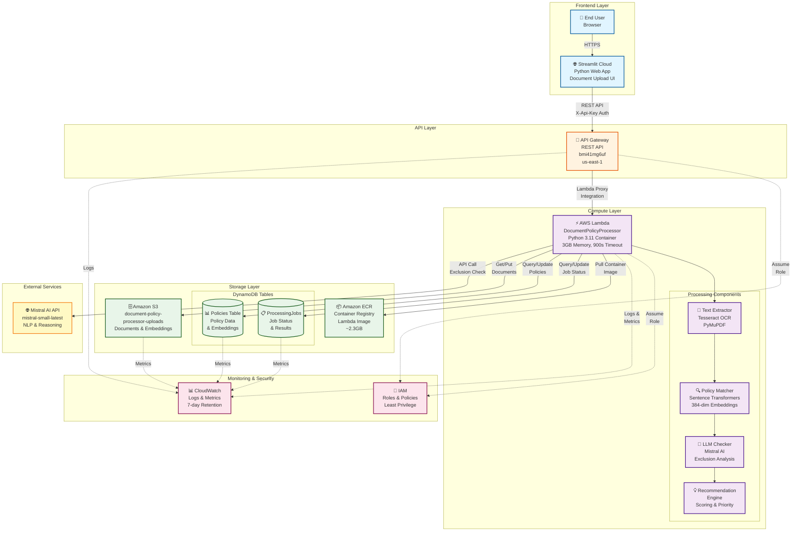
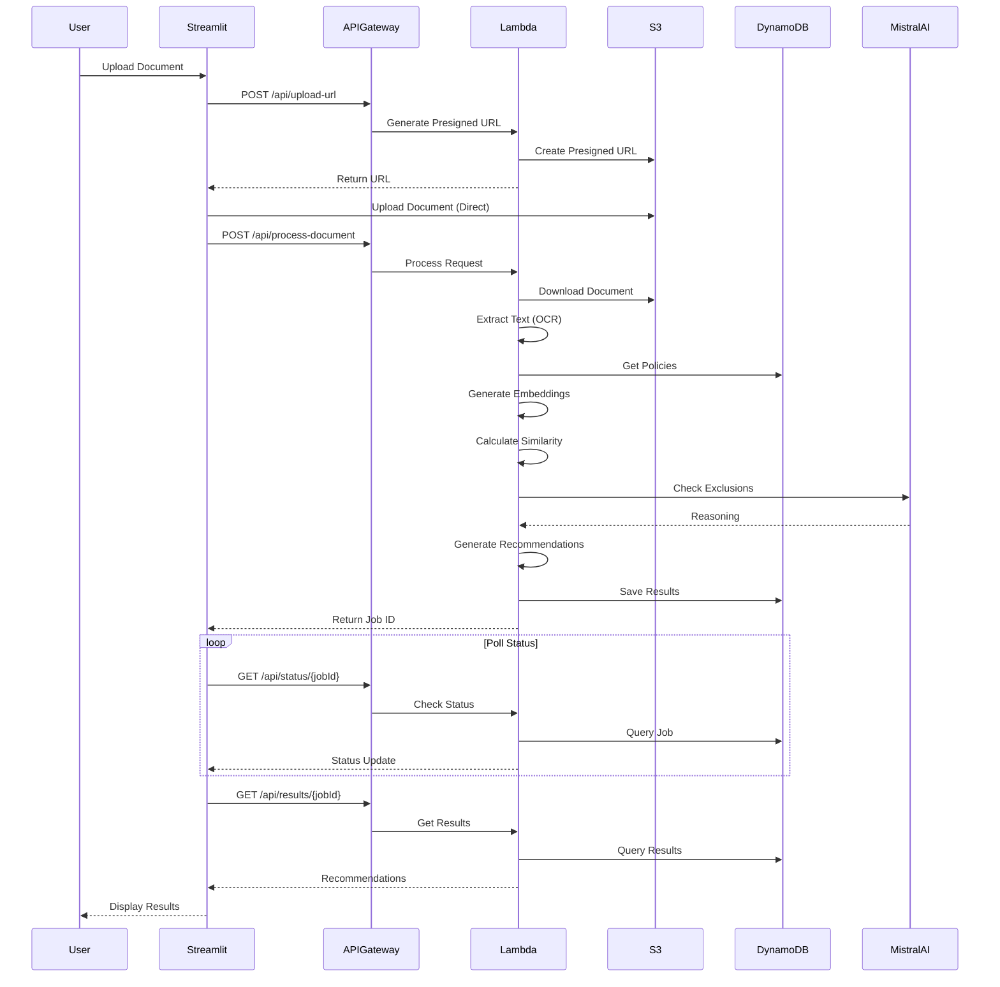
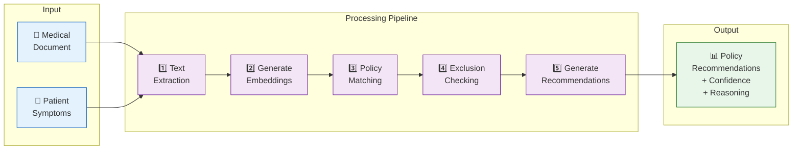
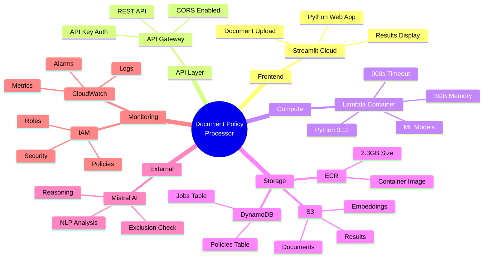
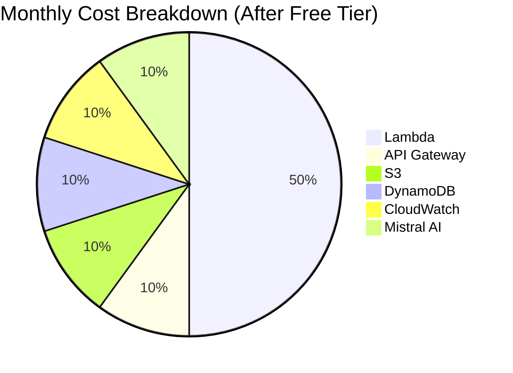
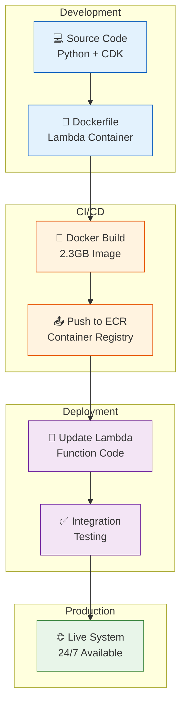

# AWS Architecture - Mermaid Diagram

## Interactive Architecture Diagram

Copy this Mermaid code into GitHub README or any Mermaid-compatible viewer:

## Simplified Flow Diagram

## Component Interaction Diagram

## AWS Services Overview

## Cost Architecture

## Deployment Architecture

---

## How to Use These Diagrams

### In GitHub README
1. Copy the Mermaid code blocks
2. Paste into your README.md
3. GitHub will automatically render them

### In Documentation Sites
- **GitBook**: Supports Mermaid natively
- **Docusaurus**: Install `@docusaurus/theme-mermaid`
- **MkDocs**: Install `mkdocs-mermaid2-plugin`

### In Presentations
1. Use [Mermaid Live Editor](https://mermaid.live/)
2. Export as PNG/SVG
3. Insert into PowerPoint/Google Slides

### In Confluence/Notion
1. Use Mermaid Live Editor
2. Export as image
3. Upload to your wiki

---

**Diagram Version**: 1.0  
**Last Updated**: March 8, 2026  
**Format**: Mermaid (GitHub-compatible)
